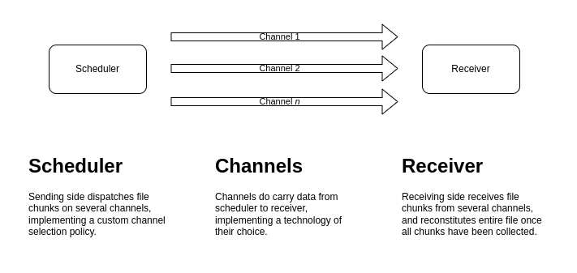

# channel_multiplexed_scheduler

This repository holds `Receiver` and `Scheduler` class, that can be used to send/receive files 
through channels.

## General architecture

<p align="center">
  
</p>

#### Scheduler

**A scheduler sends a file as chunks going through multiple channels.**

It uses the [selective repeat ARQ](https://www.tutorialspoint.com/what-is-selective-repeat-arq-in-computer-networks)
technique by sending file chunks in different channels, and retrying if a chunk isn't acknowledged
by sending channel in a given time.

This package provides a `Scheduler` abstract class that must be implemented with the 
channel-selection policy of your choice.

#### Receiver

Receiver is plugged to the same channels as the scheduler, and after collecting all file chunks, it 
rebuilds the file.


## Data exchange sequence

<p align="center">
  
</p>

To avoid the struggle of manually configuring data channels on receiving end, we can use bootstrap
channels: they will send configuration information to the receiver, which will use it to open data
channels, being then ready to receive file chunks.

## Implementation

### Scheduler implementation

To implement your scheduler, you must extend the `Scheduler` class, which contains only one method
for you to implement:

```dart
/// This lets Scheduler instances implement their own chunks sending policy.
/// 
/// The implementation should send all chunks' content, by calling the 
/// sendChunk method; it can also check for any resubmission timer presence, 
/// to avoid finishing execution while some chunks have not been acknowledged.
Future<void> sendChunks(
  List<FileChunk> chunks,
  List<Channel> channels,
  Map<int, CancelableOperation> resubmissionTimers);
```

Your `sendChunks` implementation must send all `chunks` through available `channels`; the 
`resubmissionTimers` variable holds delays until a chunk is considered as not-transmitted, and must
be sent again; timers handling is done by the `Scheduler` class itself (*i.e. don't touch it*), but 
you can still check its content (like `tests/mock/scheduler/MockScheduler` does) to ensure all
chunks have been transmitted successfully.

## Getting Started

```shell
# Install dependencies.
flutter pub get

# Run tests.
flutter test
```

### File sending log example

Here is a file sending log using one channel:

```text
# File chunks are sent sequentially.
[Scheduler] Sending chunk n°0.
[Scheduler] Sending chunk n°1.
[Scheduler] Sending chunk n°2.
[Scheduler] Sending chunk n°3.
[Scheduler] Sending chunk n°4.
[Scheduler] Sending chunk n°5.
[Scheduler] Sending chunk n°6.
[Scheduler] Sending chunk n°7.
[Scheduler] Sending chunk n°8.

# Some are acknowledged.
[Scheduler] Chunk n°7 was acknowledged.
[Scheduler] Chunk n°8 was acknowledged.
[Scheduler] Chunk n°5 was acknowledged.

# Some time out.
[Scheduler] Chunk n°0 was not acknowledged in time, resending.
[Scheduler] Chunk n°4 was acknowledged.
[Scheduler] Chunk n°1 was not acknowledged in time, resending.
[Scheduler] Chunk n°2 was not acknowledged in time, resending.
[Scheduler] Chunk n°3 was not acknowledged in time, resending.
[Scheduler] Chunk n°6 was not acknowledged in time, resending.

# Chunks which timed out are sent anew.
[Scheduler] Sending chunk n°6.
[Scheduler] Sending chunk n°3.
[Scheduler] Sending chunk n°2.
[Scheduler] Sending chunk n°1.
[Scheduler] Sending chunk n°0.
[Scheduler] Chunk n°2 was acknowledged.
[Scheduler] Chunk n°0 was acknowledged.
[Scheduler] Chunk n°1 was acknowledged.
[Scheduler] Chunk n°6 was acknowledged.
[Scheduler] Chunk n°3 was acknowledged.

# File sending ends when all chunks have been acknowledged.
[Scheduler] Finished dispatching all chunks to channels.
```